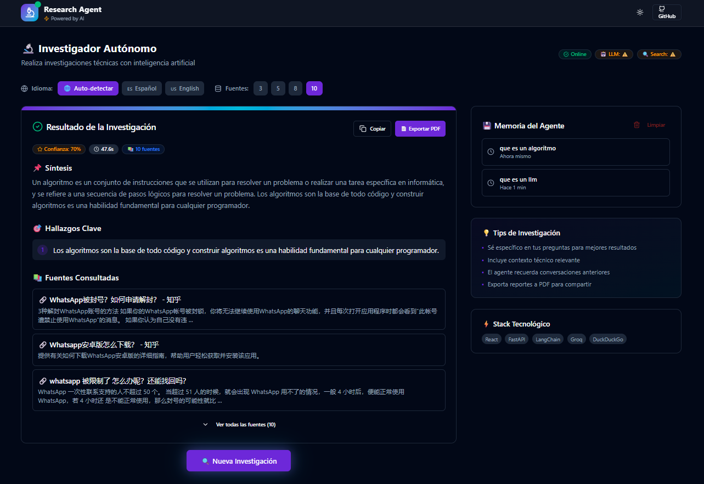
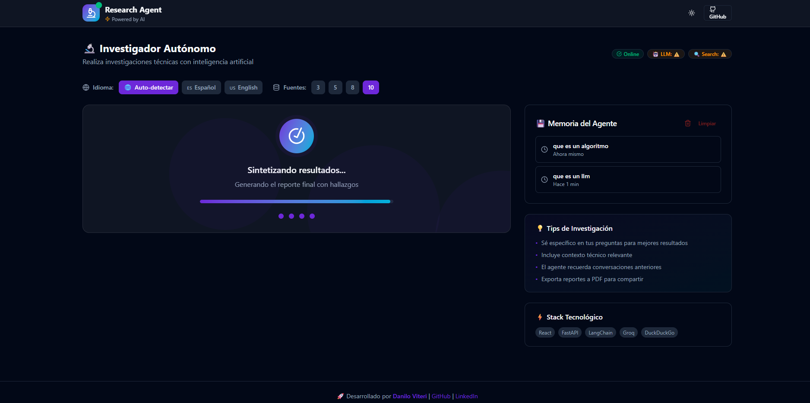
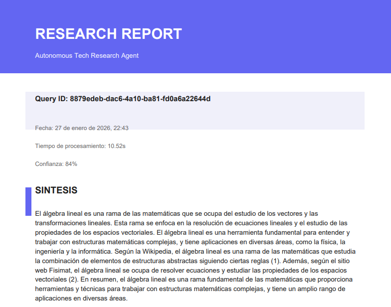

<div align="center">

# 🔬 Agente Autónomo de Investigación Técnica

[](https://python.org)
[](https://fastapi.tiangolo.com)
[](https://react.dev)
[](https://langchain.com)
[](https://sqlite.org)
[](LICENSE)
[](https://console.groq.com)

**Un agente de inteligencia artificial que investiga cualquier tema técnico, busca en internet, analiza la información y entrega reportes estructurados en segundos.**

*Desarrollado por **Danilo Viteri***

[🚀 Inicio Rápido](#-inicio-rápido) •
[📸 Capturas](#-capturas-de-pantalla) •
[⚙️ Instalación](#-instalación-completa) •
[📡 API](#-uso-de-la-api) •
[🏗️ Arquitectura](#-arquitectura-del-sistema)

</div>

---

## 📸 Capturas de Pantalla

<div align="center">

### 🎯 Resultado de Investigación


*Investigación completa con síntesis, hallazgos clave y fuentes verificadas*

---

### ⚡ Proceso de Investigación


*Animación fluida mientras el agente investiga en tiempo real*

---

### 📄 Exportación a PDF


*Exportación profesional a PDF para compartir o archivar*

</div>

---

## 🎯 ¿Qué es esto?

### Para Todos

Imagina tener un **asistente personal inteligente** que puede:

| Paso | Acción |
|:----:|--------|
| 1️⃣ | 🔍 **Buscar información** en todo internet sobre cualquier tema |
| 2️⃣ | 📖 **Leer y analizar** toda la información encontrada |
| 3️⃣ | 📝 **Resumir y organizar** los puntos más importantes |
| 4️⃣ | 📊 **Entregar un reporte** claro y estructurado |

**Todo esto en segundos, automáticamente.**

### Para Desarrolladores

Es un **agente de IA autónomo** construido con el patrón **ReAct** (Reason + Act) que:

- ✅ Recibe una pregunta de investigación
- ✅ Decide qué herramientas usar (búsqueda web, análisis)
- ✅ Ejecuta múltiples búsquedas iterativamente
- ✅ Sintetiza información en respuestas estructuradas
- ✅ **Mantiene memoria persistente** en SQLite

---

## 🚀 Inicio Rápido

### Prerrequisitos

- 🐍 **Python 3.11+**
- 📦 **Node.js 18+**
- 🔑 **Cuenta Groq** (gratis) → [console.groq.com](https://console.groq.com/)

### Un Solo Comando

```bash
# 1. Clonar repositorio
git clone https://github.com/KRSNA-BLR/Autonomous-Technical-Auditor-Agent.git
cd Autonomous-Technical-Auditor-Agent

# 2. Configurar API key
cp .env.example .env
# Editar .env y agregar tu GROQ_API_KEY

# 3. Instalar dependencias
pip install -e ".[dev]"
cd frontend && npm install && cd ..

# 4. ¡Ejecutar todo!
npm run dev
```

🌐 Abre **http://localhost:3000** y comienza a investigar.

---

## ✨ Características Principales

<table>
<tr>
<td width="50%">

### 🤖 Agente de IA Autónomo
- Patrón **ReAct** con LangChain
- Modelo **Llama 3.3 70B** vía Groq
- Búsqueda web con **DuckDuckGo**

### 🎨 Dashboard Moderno
- **React 19** + **Vite 6** + **Tailwind CSS 4**
- Animaciones con **Framer Motion**
- Modo oscuro/claro
- Diseño responsive

</td>
<td width="50%">

### 🌐 Soporte Multiidioma
- Selector: **Auto** | **Español** | **Inglés**
- Detección automática del idioma
- Resultados localizados

### 📊 Control de Fuentes
- Selector: **3** | **5** | **8** | **10** fuentes
- Filtrado inteligente
- Evaluación de credibilidad

</td>
</tr>
<tr>
<td>

### 📄 Exportación PDF
- Reportes profesionales
- Formato limpio
- Compatible universal

</td>
<td>

### 💾 Memoria Persistente
- Historial en **SQLite**
- Contexto inteligente
- Búsqueda en historial

</td>
</tr>
</table>

---

## 🏗️ Arquitectura del Sistema

Este proyecto implementa **Arquitectura Hexagonal** (Ports & Adapters):

```
┌─────────────────────────────────────────────────────────────────────────┐
│                         🌐 CAPA DE PRESENTACIÓN                         │
│  ┌────────────────────────────────┬────────────────────────────────┐    │
│  │   React 19 + Vite + Tailwind   │      FastAPI REST API          │    │
│  │      http://localhost:3000     │    http://localhost:8000       │    │
│  └────────────────────────────────┴────────────────────────────────┘    │
└─────────────────────────────────────────────────────────────────────────┘
                                    │
                                    ▼
┌─────────────────────────────────────────────────────────────────────────┐
│                         ⚙️ CAPA DE APLICACIÓN                           │
│  ┌─────────────────┐  ┌─────────────────┐  ┌─────────────────────────┐  │
│  │ Research Agent  │  │ Memory Manager  │  │   Tools (Search/Analyze)│  │
│  │ (LangChain)     │  │ (SQLite)        │  │   (DuckDuckGo)          │  │
│  └─────────────────┘  └─────────────────┘  └─────────────────────────┘  │
└─────────────────────────────────────────────────────────────────────────┘
                                    │
                                    ▼
┌─────────────────────────────────────────────────────────────────────────┐
│                       📦 CAPA DE INFRAESTRUCTURA                        │
│  ┌─────────────────┐  ┌─────────────────┐  ┌─────────────────────────┐  │
│  │  Groq Adapter   │  │ DuckDuckGo      │  │   SQLite Database       │  │
│  │  (LLM API)      │  │ Adapter         │  │   (Persistencia)        │  │
│  └─────────────────┘  └─────────────────┘  └─────────────────────────┘  │
└─────────────────────────────────────────────────────────────────────────┘
                                    │
                                    ▼
┌─────────────────────────────────────────────────────────────────────────┐
│                          🎯 CAPA DE DOMINIO                             │
│  ┌─────────────────┐  ┌─────────────────┐  ┌─────────────────────────┐  │
│  │  Query Entity   │  │ Research Entity │  │   Report Entity         │  │
│  └─────────────────┘  └─────────────────┘  └─────────────────────────┘  │
└─────────────────────────────────────────────────────────────────────────┘
```

### Flujo de Datos

```
┌──────────┐     ┌──────────┐     ┌──────────┐     ┌──────────┐     ┌──────────┐
│ Usuario  │────▶│ Frontend │────▶│   API    │────▶│  Agent   │────▶│ Respuesta│
│ Pregunta │     │  React   │     │ FastAPI  │     │ LangChain│     │   JSON   │
└──────────┘     └──────────┘     └──────────┘     └──────────┘     └──────────┘
                                        │               │
                                        │               ▼
                                        │         ┌──────────┐
                                        │         │   Groq   │
                                        │         │   LLM    │
                                        │         └──────────┘
                                        │               │
                                        ▼               ▼
                                  ┌──────────┐   ┌──────────┐
                                  │  SQLite  │   │DuckDuckGo│
                                  │ Memoria  │   │ Búsqueda │
                                  └──────────┘   └──────────┘
```

---

## 🛠️ Stack Tecnológico

### Backend

| Tecnología | Propósito | Costo |
|:-----------|:----------|:-----:|
| **Python 3.11+** | Lenguaje principal | 🆓 |
| **FastAPI** | Framework web async | 🆓 |
| **LangChain** | Framework de agentes | 🆓 |
| **Groq** | LLM API (Llama 3.3 70B) | 🆓 |
| **DuckDuckGo** | Búsqueda sin API key | 🆓 |
| **SQLite** | Base de datos memoria | 🆓 |
| **Pydantic v2** | Validación de datos | 🆓 |

### Frontend

| Tecnología | Propósito | Costo |
|:-----------|:----------|:-----:|
| **React 19** | Framework UI | 🆓 |
| **Vite 6** | Build tool | 🆓 |
| **Tailwind CSS 4** | Estilos | 🆓 |
| **Framer Motion** | Animaciones | 🆓 |
| **jsPDF** | Exportación PDF | 🆓 |
| **Lucide React** | Iconos | 🆓 |

<div align="center">

### 💰 Costo Total: **$0**

</div>

---

## ⚙️ Instalación Completa

### Opción 1: Desarrollo Local

```bash
# Clonar repositorio
git clone https://github.com/KRSNA-BLR/Autonomous-Technical-Auditor-Agent.git
cd Autonomous-Technical-Auditor-Agent

# Crear entorno virtual Python
python -m venv .venv

# Activar entorno
# Windows:
.venv\Scripts\activate
# Mac/Linux:
source .venv/bin/activate

# Instalar dependencias backend
pip install -e ".[dev]"

# Instalar dependencias frontend
cd frontend && npm install && cd ..

# Configurar variables de entorno
cp .env.example .env
# Editar .env y agregar GROQ_API_KEY

# Ejecutar ambos servidores
npm run dev
```

### Opción 2: Docker

```bash
# Configurar variables
cp .env.example .env
# Editar .env con GROQ_API_KEY

# Construir y ejecutar
docker-compose up --build

# Frontend: http://localhost:3000
# Backend:  http://localhost:8000
```

---

## 🔧 Configuración

### Variables de Entorno (.env)

```env
# ═══════════════════════════════════════════════
# LLM (Groq - Gratis)
# ═══════════════════════════════════════════════
GROQ_API_KEY=gsk_tu_api_key_aqui
LLM_MODEL=llama-3.3-70b-versatile

# ═══════════════════════════════════════════════
# API
# ═══════════════════════════════════════════════
API_HOST=0.0.0.0
API_PORT=8000
API_DEBUG=false

# ═══════════════════════════════════════════════
# Agente
# ═══════════════════════════════════════════════
AGENT_MAX_ITERATIONS=15
AGENT_MEMORY_SIZE=100
DEFAULT_MAX_SOURCES=8

# ═══════════════════════════════════════════════
# Base de Datos de Memoria
# ═══════════════════════════════════════════════
MEMORY_DB_PATH=./data/memory.db

# ═══════════════════════════════════════════════
# Logs
# ═══════════════════════════════════════════════
LOG_LEVEL=INFO
LOG_FORMAT=json
```

### 🔑 Obtener API Key de Groq (Gratis)

1. Ir a [console.groq.com](https://console.groq.com/)
2. Crear cuenta gratuita
3. Ir a "API Keys" → "Create API Key"
4. Copiar la key a tu archivo `.env`

---

## 📡 Uso de la API

### Endpoints Principales

| Método | Endpoint | Descripción |
|:------:|:---------|:------------|
| `POST` | `/api/v1/research` | Realizar investigación |
| `GET` | `/api/v1/memory` | Ver historial de memoria |
| `DELETE` | `/api/v1/memory` | Limpiar memoria |
| `GET` | `/api/v1/status` | Estado del agente |
| `GET` | `/docs` | Documentación Swagger |

### Ejemplo de Uso

```bash
curl -X POST "http://localhost:8000/api/v1/research" \
  -H "Content-Type: application/json" \
  -d '{
    "question": "¿Cuáles son las mejores prácticas de Python en 2026?",
    "language": "es",
    "max_sources": 8
  }'
```

### Respuesta

```json
{
  "query_id": "550e8400-e29b-41d4-a716-446655440000",
  "status": "completed",
  "synthesis": "Las mejores prácticas de Python en 2026 incluyen...",
  "key_findings": [
    "Usar type hints en todo el código",
    "Preferir f-strings sobre format()",
    "Implementar async/await para I/O"
  ],
  "sources": [
    {
      "title": "Python Best Practices 2026",
      "url": "https://...",
      "snippet": "..."
    }
  ],
  "confidence_score": 0.85,
  "processing_time_ms": 4200
}
```

---

## 💾 Memoria Persistente (SQLite)

El agente utiliza **SQLite** para almacenar el historial de investigaciones:

### Características

| Característica | Descripción |
|:---------------|:------------|
| 🔄 **Persistencia** | Los datos sobreviven reinicios |
| 🧠 **Contexto inteligente** | Usa investigaciones previas |
| 🔍 **Búsqueda** | Buscar por palabras clave |
| 🧹 **Auto-limpieza** | Mantiene últimas 100 entradas |

### Ubicación

```
./data/memory.db
```

### Esquema

```sql
CREATE TABLE memory_entries (
    id INTEGER PRIMARY KEY AUTOINCREMENT,
    query TEXT NOT NULL,
    response TEXT NOT NULL,
    timestamp TEXT NOT NULL,
    metadata TEXT DEFAULT '{}'
);
```

---

## 📁 Estructura del Proyecto

```
autonomous-tech-research-agent/
│
├── 📂 src/                           # Backend Python
│   ├── 📂 domain/                    # Entidades y reglas de negocio
│   │   ├── entities/                 # Query, Research, Report
│   │   └── ports/                    # Interfaces (contratos)
│   │
│   ├── 📂 application/               # Lógica de aplicación
│   │   ├── services/                 # Agente, Memoria
│   │   └── tools/                    # Herramientas del agente
│   │
│   └── 📂 infrastructure/            # Adaptadores externos
│       ├── api/                      # FastAPI endpoints
│       └── adapters/                 # Groq, DuckDuckGo
│
├── 📂 frontend/                      # Frontend React
│   ├── 📂 src/
│   │   ├── components/               # Componentes UI
│   │   ├── hooks/                    # Custom hooks
│   │   └── lib/                      # API client, utils
│   └── package.json
│
├── 📂 docs/                          # Documentación
│   └── images/                       # Screenshots
│
├── 📂 data/                          # Base de datos (gitignored)
│   └── memory.db                     # SQLite memoria
│
├── 📂 tests/                         # Tests
├── docker-compose.yml                # Docker setup
├── package.json                      # Scripts npm
└── pyproject.toml                    # Dependencias Python
```

---

## 🧪 Tests

```bash
# Ejecutar todos los tests
pytest tests/ -v

# Con cobertura
pytest tests/ -v --cov=src --cov-report=html

# Solo tests unitarios
pytest tests/unit/ -v

# Solo tests de integración
pytest tests/integration/ -v
```

---

## 🚀 Despliegue

### Docker (Recomendado)

```bash
docker-compose up -d
```

### Render.com (Gratis)

1. Conectar repositorio GitHub
2. Configurar variables de entorno
3. Deploy automático en cada push

### Railway (Gratis)

```bash
railway login
railway init
railway up
```

---

## 🤝 Contribuir

¡Las contribuciones son bienvenidas!

1. Fork del repositorio
2. Crear rama (`git checkout -b feature/nueva-caracteristica`)
3. Commit (`git commit -m 'Agregar nueva característica'`)
4. Push (`git push origin feature/nueva-caracteristica`)
5. Abrir Pull Request

---

## 📄 Licencia

Este proyecto está bajo la Licencia MIT. Ver [LICENSE](LICENSE) para más detalles.

---

## 📬 Contacto

**Danilo Viteri**

- 💼 LinkedIn: [linkedin.com/in/danilo-viteri](https://linkedin.com/in/danilo-viteri)
- 🐙 GitHub: [github.com/daniloviteri](https://github.com/daniloviteri)

---

<div align="center">

### ⭐ Si este proyecto te fue útil, considera darle una estrella en GitHub ⭐

*Desarrollado con ❤️ por Danilo Viteri*

</div>
