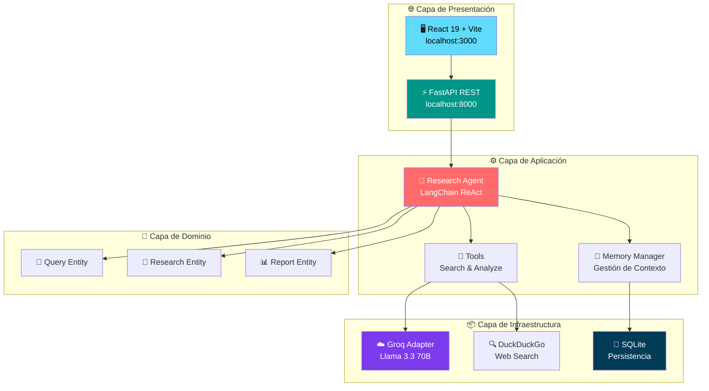
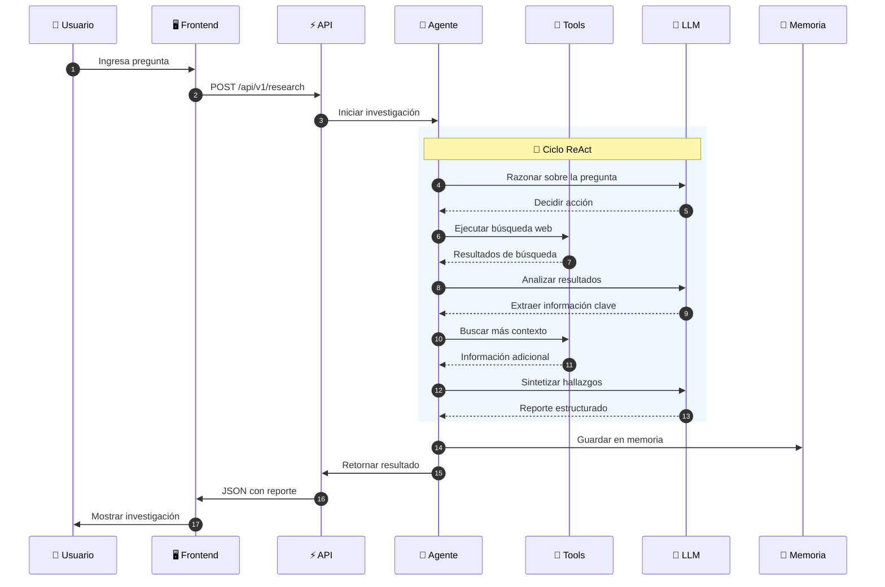
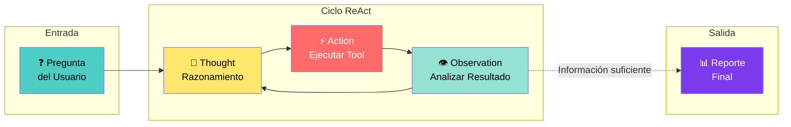
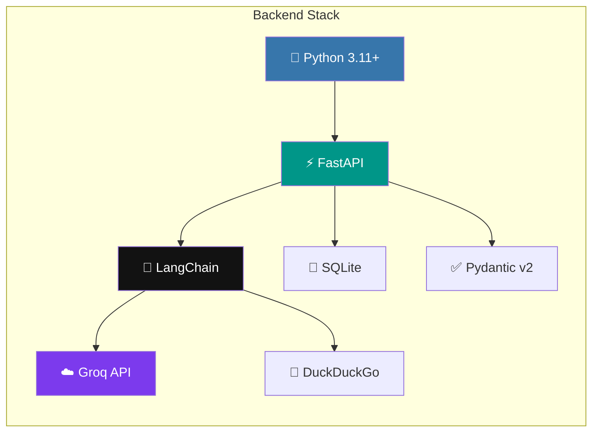
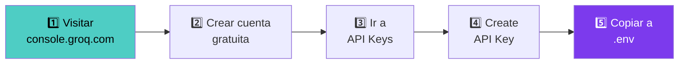
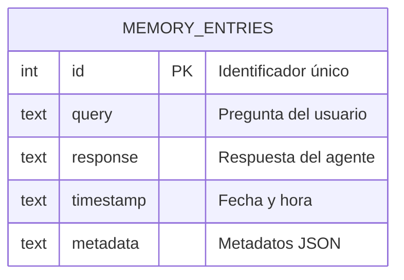

<div align="center">

# 🔬 Agente Autónomo de Investigación Técnica

[](https://python.org)
[](https://fastapi.tiangolo.com)
[](https://react.dev)
[](https://langchain.com)
[](https://sqlite.org)
[](LICENSE)
[](https://console.groq.com)

**Sistema de inteligencia artificial autónomo que investiga cualquier tema técnico, busca en internet, analiza información y genera reportes estructurados en segundos.**

<br/>

*Desarrollado por [Danilo Viteri](https://www.linkedin.com/in/danilo-viteri-moreno/)*

<br/>

[🚀 Inicio Rápido](#-inicio-rápido) •
[📸 Capturas](#-capturas-de-pantalla) •
[🏛️ Arquitectura](#%EF%B8%8F-arquitectura-del-sistema) •
[📡 API](#-documentación-de-la-api) •
[🤝 Contribuir](#-contribuir)

</div>

---

## 📋 Tabla de Contenidos

- [📸 Capturas de Pantalla](#-capturas-de-pantalla)
- [🎯 ¿Qué es este proyecto?](#-qué-es-este-proyecto)
- [✨ Características Principales](#-características-principales)
- [🚀 Inicio Rápido](#-inicio-rápido)
- [🏛️ Arquitectura del Sistema](#%EF%B8%8F-arquitectura-del-sistema)
- [🔄 Flujo del Agente ReAct](#-flujo-del-agente-react)
- [🛠️ Stack Tecnológico](#%EF%B8%8F-stack-tecnológico)
- [⚙️ Instalación Completa](#%EF%B8%8F-instalación-completa)
- [🔧 Configuración](#-configuración)
- [📡 Documentación de la API](#-documentación-de-la-api)
- [💾 Sistema de Memoria](#-sistema-de-memoria)
- [📁 Estructura del Proyecto](#-estructura-del-proyecto)
- [🧪 Tests](#-tests)
- [🚢 Despliegue](#-despliegue)
- [🤝 Contribuir](#-contribuir)
- [📄 Licencia](#-licencia)
- [📬 Contacto](#-contacto)

---

## 📸 Capturas de Pantalla

<div align="center">

### 🎯 Resultado de Investigación


*Investigación completa con síntesis, hallazgos clave y fuentes verificadas*

---

### ⚡ Proceso de Investigación


*Animación fluida mientras el agente investiga en tiempo real*

---

### 📄 Exportación a PDF


*Exportación profesional a PDF para compartir o archivar*

</div>

---

## 🎯 ¿Qué es este proyecto?

### 📖 Para Usuarios No Técnicos

Imagina tener un **asistente personal inteligente** que puede investigar cualquier tema por ti:

| Paso | Descripción | Icono |
|:----:|:------------|:-----:|
| 1 | Escribe tu pregunta en lenguaje natural | 💬 |
| 2 | El agente busca información en todo internet | 🔍 |
| 3 | Analiza y procesa toda la información encontrada | 🧠 |
| 4 | Te entrega un reporte claro y estructurado | 📊 |

> **Ejemplo:** Pregunta *"¿Cuáles son las mejores prácticas de Python en 2026?"* y obtén un reporte completo con fuentes verificadas en segundos.

### 💻 Para Desarrolladores

Es un **agente de IA autónomo** construido con el patrón **ReAct** (Reasoning + Acting) que:

- ✅ Implementa **Arquitectura Hexagonal** (Ports & Adapters)
- ✅ Utiliza **LangChain** para orquestación de agentes
- ✅ Ejecuta búsquedas iterativas con **DuckDuckGo**
- ✅ Procesa información con **Llama 3.3 70B** vía Groq
- ✅ Mantiene **memoria persistente** en SQLite
- ✅ Expone una **API REST** con FastAPI
- ✅ Incluye **frontend moderno** con React 19

---

## ✨ Características Principales

<table>
<tr>
<td width="50%" valign="top">

### 🤖 Agente IA Autónomo
- Patrón **ReAct** con LangChain
- Modelo **Llama 3.3 70B** vía Groq
- Búsqueda web con **DuckDuckGo**
- Razonamiento multi-paso inteligente

### 🎨 Dashboard Moderno
- **React 19** + **Vite 6** + **Tailwind CSS 4**
- Animaciones fluidas con **Framer Motion**
- Modo oscuro y claro
- Diseño completamente responsive

</td>
<td width="50%" valign="top">

### 🌐 Soporte Multiidioma
- Selector: **Auto** | **Español** | **Inglés**
- Detección automática del idioma
- Resultados completamente localizados

### 📊 Control de Fuentes
- Selector: **3** | **5** | **8** | **10** fuentes
- Filtrado inteligente por relevancia
- Evaluación de credibilidad automática

</td>
</tr>
<tr>
<td valign="top">

### 📄 Exportación PDF
- Reportes con formato profesional
- Diseño limpio y estructurado
- Compatible con cualquier dispositivo

</td>
<td valign="top">

### 💾 Memoria Persistente
- Historial guardado en **SQLite**
- Contexto inteligente entre sesiones
- Búsqueda en investigaciones previas

</td>
</tr>
</table>

---

## 🚀 Inicio Rápido

### 📋 Prerrequisitos

| Requisito | Versión | Enlace |
|:----------|:--------|:-------|
| Python | 3.11+ | [python.org](https://python.org) |
| Node.js | 18+ | [nodejs.org](https://nodejs.org) |
| Groq API Key | Gratis | [console.groq.com](https://console.groq.com) |

### ⚡ Instalación en 4 Pasos

```bash
# 1️⃣ Clonar el repositorio
git clone https://github.com/KRSNA-BLR/Autonomous-Technical-Auditor-Agent.git
cd Autonomous-Technical-Auditor-Agent

# 2️⃣ Configurar API key
cp .env.example .env
# Editar .env y agregar tu GROQ_API_KEY

# 3️⃣ Instalar dependencias
pip install -e ".[dev]"
cd frontend && npm install && cd ..

# 4️⃣ Ejecutar la aplicación
npm run dev
```

### 🌐 Acceder a la Aplicación

| Servicio | URL | Descripción |
|:---------|:----|:------------|
| Frontend | http://localhost:3000 | Interfaz de usuario |
| Backend | http://localhost:8000 | API REST |
| Documentación | http://localhost:8000/docs | Swagger UI |

---

## 🏛️ Arquitectura del Sistema

Este proyecto implementa **Arquitectura Hexagonal** (Ports & Adapters), garantizando separación de responsabilidades, testabilidad y mantenibilidad.

### 📐 Diagrama de Arquitectura



### 🏗️ Capas de la Arquitectura

| Capa | Responsabilidad | Componentes |
|:-----|:----------------|:------------|
| **Presentación** | Interfaz de usuario y API REST | React, FastAPI |
| **Aplicación** | Lógica de negocio y orquestación | Agent, Memory, Tools |
| **Infraestructura** | Adaptadores externos | Groq, DuckDuckGo, SQLite |
| **Dominio** | Entidades y reglas de negocio | Query, Research, Report |

---

## 🔄 Flujo del Agente ReAct

El agente utiliza el patrón **ReAct** (Reasoning + Acting) para investigar de forma autónoma:



### 🧠 Proceso de Razonamiento



---

## 🛠️ Stack Tecnológico

### 🔧 Backend



| Tecnología | Propósito | Costo |
|:-----------|:----------|:-----:|
| **Python 3.11+** | Lenguaje principal | 🆓 Gratis |
| **FastAPI** | Framework web asíncrono | 🆓 Gratis |
| **LangChain** | Framework de agentes IA | 🆓 Gratis |
| **Groq** | LLM API (Llama 3.3 70B) | 🆓 Gratis |
| **DuckDuckGo** | Búsqueda web sin API key | 🆓 Gratis |
| **SQLite** | Base de datos para memoria | 🆓 Gratis |
| **Pydantic v2** | Validación de datos | 🆓 Gratis |

### 🎨 Frontend

| Tecnología | Propósito | Costo |
|:-----------|:----------|:-----:|
| **React 19** | Framework de UI | 🆓 Gratis |
| **Vite 6** | Build tool ultrarrápido | 🆓 Gratis |
| **Tailwind CSS 4** | Framework de estilos | 🆓 Gratis |
| **Framer Motion** | Animaciones fluidas | 🆓 Gratis |
| **jsPDF** | Generación de PDFs | 🆓 Gratis |
| **Lucide React** | Iconos modernos | 🆓 Gratis |

<div align="center">

### 💰 Costo Total del Proyecto: **$0**

</div>

---

## ⚙️ Instalación Completa

### 📌 Opción 1: Desarrollo Local

```bash
# Clonar el repositorio
git clone https://github.com/KRSNA-BLR/Autonomous-Technical-Auditor-Agent.git
cd Autonomous-Technical-Auditor-Agent

# Crear entorno virtual Python
python -m venv .venv

# Activar entorno virtual
# Windows:
.venv\Scripts\activate
# Mac/Linux:
source .venv/bin/activate

# Instalar dependencias del backend
pip install -e ".[dev]"

# Instalar dependencias del frontend
cd frontend && npm install && cd ..

# Configurar variables de entorno
cp .env.example .env
# Editar .env y agregar tu GROQ_API_KEY

# Ejecutar ambos servidores
npm run dev
```

### 🐳 Opción 2: Docker

```bash
# Configurar variables de entorno
cp .env.example .env
# Editar .env con tu GROQ_API_KEY

# Construir y ejecutar
docker-compose up --build

# Acceder a:
# Frontend: http://localhost:3000
# Backend:  http://localhost:8000
```

---

## 🔧 Configuración

### 📝 Variables de Entorno (.env)

```env
# ═══════════════════════════════════════════════════════════════
# 🧠 LLM (Groq - Completamente Gratis)
# ═══════════════════════════════════════════════════════════════
GROQ_API_KEY=gsk_tu_api_key_aqui
LLM_MODEL=llama-3.3-70b-versatile

# ═══════════════════════════════════════════════════════════════
# ⚡ API
# ═══════════════════════════════════════════════════════════════
API_HOST=0.0.0.0
API_PORT=8000
API_DEBUG=false

# ═══════════════════════════════════════════════════════════════
# 🤖 Agente
# ═══════════════════════════════════════════════════════════════
AGENT_MAX_ITERATIONS=15
AGENT_MEMORY_SIZE=100
DEFAULT_MAX_SOURCES=8

# ═══════════════════════════════════════════════════════════════
# 💾 Base de Datos
# ═══════════════════════════════════════════════════════════════
MEMORY_DB_PATH=./data/memory.db

# ═══════════════════════════════════════════════════════════════
# 📋 Logs
# ═══════════════════════════════════════════════════════════════
LOG_LEVEL=INFO
LOG_FORMAT=json
```

### 🔑 Obtener API Key de Groq (Gratis)



---

## 📡 Documentación de la API

### 📍 Endpoints Disponibles

| Método | Endpoint | Descripción |
|:------:|:---------|:------------|
| `POST` | `/api/v1/research` | Realizar investigación |
| `GET` | `/api/v1/memory` | Obtener historial de memoria |
| `DELETE` | `/api/v1/memory` | Limpiar memoria |
| `GET` | `/api/v1/status` | Estado del agente |
| `GET` | `/health` | Health check |
| `GET` | `/docs` | Documentación Swagger |
| `GET` | `/redoc` | Documentación ReDoc |

### 📤 Ejemplo de Solicitud

```bash
curl -X POST "http://localhost:8000/api/v1/research" \
  -H "Content-Type: application/json" \
  -d '{
    "question": "¿Cuáles son las mejores prácticas de Python en 2026?",
    "language": "es",
    "max_sources": 8
  }'
```

### 📥 Ejemplo de Respuesta

```json
{
  "query_id": "550e8400-e29b-41d4-a716-446655440000",
  "status": "completed",
  "synthesis": "Las mejores prácticas de Python en 2026 incluyen...",
  "key_findings": [
    "Usar type hints en todo el código",
    "Preferir f-strings sobre format()",
    "Implementar async/await para operaciones I/O"
  ],
  "sources": [
    {
      "title": "Python Best Practices 2026",
      "url": "https://example.com/article",
      "snippet": "Fragmento relevante del artículo...",
      "credibility": "high"
    }
  ],
  "confidence_score": 0.85,
  "processing_time_ms": 4200
}
```

---

## 💾 Sistema de Memoria

El agente utiliza **SQLite** para mantener memoria persistente entre sesiones:



### 🎯 Características de la Memoria

| Característica | Descripción |
|:---------------|:------------|
| 🔄 **Persistencia** | Los datos sobreviven reinicios del servidor |
| 🧠 **Contexto Inteligente** | Usa investigaciones previas para mejorar respuestas |
| 🔍 **Búsqueda** | Buscar por palabras clave en el historial |
| 🧹 **Auto-limpieza** | Mantiene automáticamente las últimas 100 entradas |

### 📂 Ubicación de la Base de Datos

```
./data/memory.db
```

---

## 📁 Estructura del Proyecto

```
autonomous-tech-research-agent/
│
├── 📂 src/                              # Backend Python
│   ├── 📂 domain/                       # 🎯 Capa de Dominio
│   │   ├── 📂 entities/                 # Entidades del negocio
│   │   │   ├── query.py                 # Entidad de consulta
│   │   │   ├── research.py              # Entidad de investigación
│   │   │   └── report.py                # Entidad de reporte
│   │   └── 📂 ports/                    # Interfaces (contratos)
│   │       ├── llm_port.py              # Puerto para LLM
│   │       └── search_port.py           # Puerto para búsqueda
│   │
│   ├── 📂 application/                  # ⚙️ Capa de Aplicación
│   │   ├── 📂 services/                 # Servicios de negocio
│   │   │   ├── research_agent.py        # Agente principal
│   │   │   ├── memory_manager.py        # Gestor de memoria
│   │   │   └── sqlite_memory.py         # Implementación SQLite
│   │   └── 📂 tools/                    # Herramientas del agente
│   │       ├── web_search.py            # Tool de búsqueda web
│   │       └── text_analyzer.py         # Tool de análisis
│   │
│   └── 📂 infrastructure/               # 📦 Capa de Infraestructura
│       ├── 📂 api/                      # API REST
│       │   ├── main.py                  # Aplicación FastAPI
│       │   ├── dependencies.py          # Inyección de dependencias
│       │   ├── 📂 routes/               # Endpoints
│       │   └── 📂 schemas/              # Esquemas Pydantic
│       └── 📂 adapters/                 # Adaptadores externos
│           ├── groq_adapter.py          # Adaptador Groq LLM
│           └── duckduckgo_adapter.py    # Adaptador DuckDuckGo
│
├── 📂 frontend/                         # Frontend React
│   ├── 📂 src/
│   │   ├── App.tsx                      # Componente principal
│   │   ├── 📂 components/               # Componentes UI
│   │   ├── 📂 hooks/                    # Custom hooks
│   │   └── 📂 lib/                      # API client y utilidades
│   ├── package.json                     # Dependencias npm
│   └── vite.config.ts                   # Configuración Vite
│
├── 📂 docs/                             # Documentación
│   └── 📂 images/                       # Screenshots
│
├── 📂 data/                             # Base de datos (gitignored)
│   └── memory.db                        # SQLite de memoria
│
├── 📂 tests/                            # Tests
│   ├── 📂 unit/                         # Tests unitarios
│   └── 📂 integration/                  # Tests de integración
│
├── docker-compose.yml                   # Configuración Docker
├── Dockerfile                           # Imagen Docker backend
├── pyproject.toml                       # Dependencias Python
├── package.json                         # Scripts npm principales
└── README.md                            # Este archivo
```

---

## 🧪 Tests

```bash
# Ejecutar todos los tests
pytest tests/ -v

# Ejecutar con cobertura de código
pytest tests/ -v --cov=src --cov-report=html

# Solo tests unitarios
pytest tests/unit/ -v

# Solo tests de integración
pytest tests/integration/ -v

# Tests con salida detallada
pytest tests/ -v --tb=short
```

---

## 🚢 Despliegue

### 🐳 Docker (Recomendado)

```bash
# Construir y ejecutar
docker-compose up -d

# Ver logs
docker-compose logs -f

# Detener
docker-compose down
```

### ☁️ Plataformas Cloud (Gratis)

| Plataforma | Tier Gratuito | Comando |
|:-----------|:--------------|:--------|
| **Render** | Sí | Conectar repo GitHub |
| **Railway** | Sí | `railway up` |
| **Fly.io** | Sí | `fly deploy` |

---

## 🤝 Contribuir

¡Las contribuciones son bienvenidas y apreciadas!

### 📋 Pasos para Contribuir


```bash
# 1. Fork del repositorio en GitHub

# 2. Clonar tu fork
git clone https://github.com/TU-USUARIO/Autonomous-Technical-Auditor-Agent.git

# 3. Crear rama para tu feature
git checkout -b feature/mi-nueva-caracteristica

# 4. Hacer cambios y commit
git commit -m "✨ Agregar nueva característica"

# 5. Push a tu fork
git push origin feature/mi-nueva-caracteristica

# 6. Abrir Pull Request en GitHub
```

### 📏 Guías de Estilo

- ✅ Usar **type hints** en todo el código Python
- ✅ Seguir **PEP 8** para formato de código
- ✅ Escribir **docstrings** para funciones públicas
- ✅ Agregar **tests** para nuevas funcionalidades
- ✅ Mantener mensajes de commit descriptivos

---

## 📄 Licencia

Este proyecto está bajo la **Licencia MIT**. Consulta el archivo [LICENSE](LICENSE) para más detalles.

```
MIT License

Copyright (c) 2026 Danilo Viteri

Se concede permiso, de forma gratuita, a cualquier persona que obtenga una copia
de este software y los archivos de documentación asociados, para utilizar el
Software sin restricción, incluyendo sin limitación los derechos de usar, copiar,
modificar, fusionar, publicar, distribuir, sublicenciar y/o vender copias del
Software.
```

---

## 📬 Contacto

<div align="center">

### 👨‍💻 Danilo Viteri

[](https://www.linkedin.com/in/danilo-viteri-moreno/)
[](https://github.com/KRSNA-BLR)

</div>

---

<div align="center">

### ⭐ Si este proyecto te resultó útil, considera darle una estrella en GitHub ⭐

<br/>

*Desarrollado con ❤️ por [Danilo Viteri](https://www.linkedin.com/in/danilo-viteri-moreno/)*

<br/>

[](https://python.org)
[](https://langchain.com)
[](https://react.dev)

</div>
