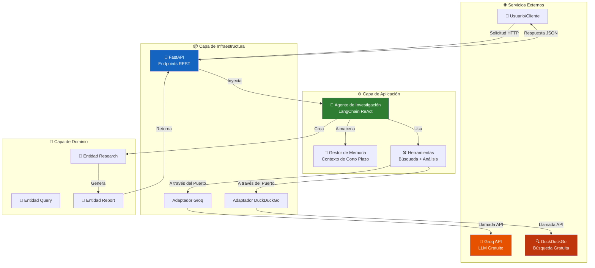

<p align="center">
  
  
  
  
  
</p>

<h1 align="center">🔬 Agente Autónomo de Investigación Técnica</h1>

<p align="center">
  <strong>Un asistente de inteligencia artificial que investiga cualquier tema técnico por ti, busca en internet, analiza la información y te entrega un reporte estructurado en segundos.</strong>
</p>

---

## 📋 Tabla de Contenidos

- [¿Qué es esto?](#-qué-es-esto)
- [¿Cómo funciona?](#-cómo-funciona-explicación-simple)
- [¿Por qué es útil?](#-por-qué-es-útil)
- [Dashboard Frontend](#-dashboard-frontend)
- [Demostración Rápida](#-demostración-rápida)
- [Arquitectura del Sistema](#-arquitectura-del-sistema)
- [Tecnologías Utilizadas](#-tecnologías-utilizadas)
- [Instalación Paso a Paso](#-instalación-paso-a-paso)
- [Uso de la API](#-uso-de-la-api)
- [Estructura del Proyecto](#-estructura-del-proyecto)
- [Decisiones Técnicas Clave](#-decisiones-técnicas-clave)
- [Pruebas](#-pruebas)
- [Despliegue en la Nube](#-despliegue-en-la-nube)
- [Contribuir al Proyecto](#-contribuir-al-proyecto)
- [Licencia](#-licencia)
- [Contacto](#-contacto)

---

## 🎯 ¿Qué es esto?

### Explicación para todos

Imagina que tienes un **asistente personal muy inteligente** que puede:

1. 🔍 **Buscar información** en todo internet sobre cualquier tema técnico
2. 📖 **Leer y analizar** toda esa información encontrada
3. 📝 **Resumir y organizar** los puntos más importantes
4. 📊 **Entregarte un reporte** claro y estructurado

**Todo esto en cuestión de segundos, automáticamente.**

### Explicación técnica

Es un **agente de IA autónomo** construido con el patrón ReAct (Reason + Act) que:

- Recibe una pregunta de investigación
- Decide qué herramientas usar (búsqueda web, análisis de texto)
- Ejecuta múltiples búsquedas y análisis de forma iterativa
- Sintetiza la información en una respuesta estructurada
- Mantiene memoria de contexto para consultas relacionadas

---

## ⚙️ ¿Cómo funciona? (Explicación Simple)

```
+-----------------------------------------------------------------------------+
|                        PROCESO DE INVESTIGACIÓN                             |
+-----------------------------------------------------------------------------+
|                                                                             |
|   PASO 1: TÚ PREGUNTAS                                                      |
|   ---------------------                                                     |
|   "¿Cuáles son las mejores prácticas para seguridad en APIs?"               |
|                                    |                                        |
|                                    v                                        |
|   PASO 2: EL AGENTE PIENSA                                                  |
|   ------------------------                                                  |
|   "Necesito buscar información actualizada sobre seguridad en APIs..."     |
|                                    |                                        |
|                                    v                                        |
|   PASO 3: BUSCA EN INTERNET                                                 |
|   -------------------------                                                 |
|   🔍 Encuentra artículos, documentación, guías de expertos                  |
|                                    |                                        |
|                                    v                                        |
|   PASO 4: ANALIZA LA INFORMACIÓN                                            |
|   ------------------------------                                            |
|   📖 Lee, comprende y extrae los puntos clave                               |
|                                    |                                        |
|                                    v                                        |
|   PASO 5: TE ENTREGA EL RESULTADO                                           |
|   -------------------------------                                           |
|   📊 Reporte organizado con hallazgos, fuentes y recomendaciones            |
|                                                                             |
+-----------------------------------------------------------------------------+
```

---

## 💪 ¿Por qué es útil?

| Sin este agente | Con este agente |
|-----------------|-----------------|
| Abres 10+ pestañas del navegador | Haces UNA pregunta |
| Lees artículo por artículo | El agente lee TODO por ti |
| Tomas notas manualmente | Recibes un reporte organizado |
| Te toma 30-60 minutos | Te toma 30 segundos |
| Puedes olvidar fuentes | Las fuentes quedan documentadas |

### Casos de Uso Reales

- 🏢 **Desarrolladores**: Investigar nuevas tecnologías antes de implementarlas
- 📚 **Estudiantes**: Investigación rápida para proyectos o tareas
- 👔 **Consultores**: Preparar análisis técnicos para clientes
- 🚀 **Emprendedores**: Evaluar tecnologías para su startup
- 📝 **Escritores técnicos**: Recopilar información para artículos

---

## 🎨 Dashboard Frontend

¡Ahora incluimos un **dashboard moderno** para probar el agente de forma visual!

### Características del Frontend

- ⚡ **Animaciones Fluidas**: Efectos visuales con Framer Motion
- 🌓 **Modo Oscuro/Claro**: Cambia el tema con un click
- 📄 **Exportar a PDF**: Descarga reportes profesionales en PDF
- 💾 **Historial de Consultas**: Memoria de tus investigaciones anteriores
- 📱 **Responsive**: Funciona en móvil, tablet y desktop

### Stack del Frontend

| Tecnología | Propósito |
|------------|-----------|
| **React 19** | Framework UI |
| **Vite 6** | Build tool ultrarrápido |
| **Tailwind CSS 4** | Estilos modernos |
| **Framer Motion** | Animaciones |
| **jsPDF** | Exportar reportes a PDF |

### Ejecutar el Frontend

```bash
# Desarrollo local
cd frontend
npm install
npm run dev

# Ahora abre http://localhost:3000
```

### Con Docker (Frontend + Backend)

```bash
# Levanta todo el sistema
docker-compose up --build

# Frontend: http://localhost:3000
# Backend API: http://localhost:8000/docs
```

---

## 🖥️ Demostración Rápida

### Hacer una consulta

```bash
curl -X POST "http://localhost:8000/api/v1/research" \
  -H "Content-Type: application/json" \
  -d '{
    "question": "Cuales son las mejores practicas de seguridad para APIs REST en 2026?"
  }'
```

### Respuesta que recibes

```json
{
  "query_id": "550e8400-e29b-41d4-a716-446655440000",
  "status": "completed",
  "synthesis": "Basado en la investigacion de multiples fuentes autorizadas, las mejores practicas de seguridad para APIs REST incluyen...",
  "key_findings": [
    "Implementar autenticacion OAuth 2.0 con tokens JWT",
    "Usar HTTPS obligatorio en todos los endpoints",
    "Aplicar rate limiting para prevenir ataques DDoS",
    "Validar todas las entradas del usuario",
    "Implementar logging y monitoreo de seguridad"
  ],
  "sources": [
    {
      "title": "OWASP API Security Top 10",
      "url": "https://owasp.org/API-Security/",
      "snippet": "Las vulnerabilidades mas criticas en APIs..."
    },
    {
      "title": "REST API Security Best Practices",
      "url": "https://example.com/security-guide",
      "snippet": "Guia completa de seguridad para APIs..."
    }
  ],
  "confidence_score": 0.87,
  "processing_time_ms": 4200
}
```

---

## 🏗️ Arquitectura del Sistema

Este proyecto sigue **Arquitectura Hexagonal** (también llamada Ports & Adapters), un patrón de diseño profesional utilizado en empresas como Netflix, Spotify y Uber.

### ¿Qué significa esto en términos simples?

Imagina una cebolla con capas:

```
                    +---------------------------------------------+
                    |         🌐 MUNDO EXTERIOR                   |
                    |    (Internet, APIs, Bases de datos)         |
                    +-----------------------+---------------------+
                                            |
                    +-----------------------v---------------------+
                    |      📦 CAPA DE INFRAESTRUCTURA             |
                    |  (FastAPI, Adaptadores de Groq y DDG)       |
                    |                                             |
                    |  Traduce entre el mundo exterior            |
                    |  y nuestra aplicación                       |
                    +-----------------------+---------------------+
                                            |
                    +-----------------------v---------------------+
                    |      ⚙️ CAPA DE APLICACIÓN                  |
                    |    (Agente de IA, Herramientas)             |
                    |                                             |
                    |  Contiene la lógica del agente              |
                    |  y orquesta las operaciones                 |
                    +-----------------------+---------------------+
                                            |
                    +-----------------------v---------------------+
                    |        🎯 CAPA DE DOMINIO                   |
                    |  (Entidades: Query, Research, Report)       |
                    |                                             |
                    |  El corazón del sistema                     |
                    |  Reglas de negocio puras                    |
                    +---------------------------------------------+
```

### Diagrama Técnico Completo



---

## 🛠️ Tecnologías Utilizadas

### ¿Por qué elegí estas tecnologías?

| Tecnología | Qué es | Por qué la uso | Costo |
|------------|--------|----------------|-------|
| **Python 3.11+** | Lenguaje de programación | El más usado en IA/ML, sintaxis clara | 🆓 Gratis |
| **FastAPI** | Framework web | Rápido, moderno, documentación automática | 🆓 Gratis |
| **LangChain** | Framework de IA | Facilita crear agentes inteligentes | 🆓 Gratis |
| **Groq** | Proveedor de LLM | Acceso a Llama 3.3 gratis, ultra rápido | 🆓 Gratis |
| **DuckDuckGo** | Motor de búsqueda | No requiere API key, ilimitado | 🆓 Gratis |
| **Pydantic v2** | Validación de datos | Garantiza datos correctos, tipado fuerte | 🆓 Gratis |
| **Docker** | Contenedores | Mismo ambiente en cualquier computadora | 🆓 Gratis |

### Costo Total: $0 💵

Este proyecto está diseñado para funcionar **100% gratis** utilizando:
- Groq Free Tier (modelos de IA gratuitos)
- DuckDuckGo (búsqueda sin API key)
- GitHub Actions (CI/CD gratis para repos públicos)
- Render/Railway (hosting gratis para demos)

---

## 📥 Instalación Paso a Paso

### Requisitos Previos

Antes de empezar, necesitas tener instalado:

- ✅ **Python 3.11 o superior** - [Descargar aquí](https://www.python.org/downloads/)
- ✅ **Git** - [Descargar aquí](https://git-scm.com/downloads)
- ✅ **Una cuenta de Groq** (gratis) - [Crear cuenta aquí](https://console.groq.com/)

### Opción 1: Instalación Local (Recomendada para desarrollo)

```bash
# PASO 1: Clonar el repositorio
git clone https://github.com/tu-usuario/autonomous-tech-research-agent.git
cd autonomous-tech-research-agent

# PASO 2: Crear entorno virtual (aísla las dependencias)
python -m venv .venv

# PASO 3: Activar el entorno virtual
# En Windows:
.venv\Scripts\activate
# En Mac/Linux:
source .venv/bin/activate

# PASO 4: Instalar dependencias
pip install -e ".[dev]"

# PASO 5: Configurar variables de entorno
copy .env.example .env
# Abre el archivo .env y agrega tu GROQ_API_KEY

# PASO 6: Ejecutar el servidor
uvicorn src.infrastructure.api.main:app --reload

# PASO 7: Abrir la documentación
# Ve a: http://localhost:8000/docs
```

### Opción 2: Usando Docker (Recomendada para producción)

```bash
# PASO 1: Clonar el repositorio
git clone https://github.com/tu-usuario/autonomous-tech-research-agent.git
cd autonomous-tech-research-agent

# PASO 2: Configurar variables de entorno
copy .env.example .env
# Edita .env y agrega tu GROQ_API_KEY

# PASO 3: Construir y ejecutar con Docker Compose
docker-compose up --build

# PASO 4: Acceder a la API
# Ve a: http://localhost:8000/docs
```

### ¿Cómo obtener la API Key de Groq? (Gratis)

1. Ve a [console.groq.com](https://console.groq.com/)
2. Crea una cuenta gratuita (puedes usar Google o GitHub)
3. Ve a "API Keys" en el menú
4. Haz clic en "Create API Key"
5. Copia la key y pégala en tu archivo `.env`

```env
GROQ_API_KEY=gsk_tu_api_key_aqui
```

---

## 📡 Uso de la API

### Endpoints Disponibles

| Método | Endpoint | Descripción |
|--------|----------|-------------|
| `POST` | `/api/v1/research` | Realizar una investigación |
| `POST` | `/api/v1/research/report` | Generar un reporte completo |
| `GET` | `/api/v1/memory` | Ver el estado de la memoria |
| `DELETE` | `/api/v1/memory` | Limpiar la memoria |
| `GET` | `/api/v1/status` | Ver el estado del agente |
| `GET` | `/health` | Verificar que el servicio está activo |
| `GET` | `/docs` | Documentación interactiva (Swagger) |

### Ejemplo Completo de Uso

```python
import requests

# Configuración
API_URL = "http://localhost:8000/api/v1"

# Realizar una investigación
response = requests.post(
    f"{API_URL}/research",
    json={
        "question": "¿Qué es Docker y por qué debería usarlo?",
        "context": "Soy un desarrollador principiante",
        "query_type": "technical",
        "priority": "high",
        "max_sources": 5
    }
)

# Ver resultados
result = response.json()
print(f"Estado: {result['status']}")
print(f"Síntesis: {result['synthesis']}")
print(f"Hallazgos clave:")
for finding in result['key_findings']:
    print(f"  - {finding}")
```

---

## 📁 Estructura del Proyecto

```
autonomous-tech-research-agent/
|
+-- 📂 src/                          # Código fuente principal
|   |
|   +-- 📂 domain/                   # 🎯 CAPA DE DOMINIO
|   |   |                            # (Reglas de negocio puras)
|   |   +-- 📂 entities/             # Entidades del negocio
|   |   |   +-- query.py             # Representa una pregunta de investigación
|   |   |   +-- research.py          # Representa los resultados
|   |   |   +-- report.py            # Representa el reporte final
|   |   |
|   |   +-- 📂 ports/                # Interfaces abstractas
|   |       +-- llm_port.py          # Contrato para cualquier LLM
|   |       +-- search_port.py       # Contrato para cualquier buscador
|   |
|   +-- 📂 application/              # ⚙️ CAPA DE APLICACIÓN
|   |   |                            # (Lógica del agente)
|   |   +-- 📂 services/
|   |   |   +-- research_agent.py    # 🤖 El agente principal
|   |   |   +-- memory_manager.py    # 💾 Gestión de memoria
|   |   |
|   |   +-- 📂 tools/                # Herramientas del agente
|   |       +-- web_search.py        # 🔍 Búsqueda en internet
|   |       +-- text_analyzer.py     # 📝 Análisis de texto
|   |
|   +-- 📂 infrastructure/           # 📦 CAPA DE INFRAESTRUCTURA
|       |                            # (Conexiones externas)
|       +-- 📂 adapters/
|       |   +-- groq_adapter.py      # Implementación de Groq
|       |   +-- duckduckgo_adapter.py # Implementación de DuckDuckGo
|       |
|       +-- 📂 api/
|           +-- main.py              # 🚀 Aplicación FastAPI
|           +-- dependencies.py      # Inyección de dependencias
|           +-- 📂 routes/           # Endpoints de la API
|           +-- 📂 schemas/          # Modelos de request/response
|
+-- 📂 tests/                        # 🧪 Pruebas automatizadas
|   +-- 📂 unit/                     # Pruebas unitarias
|   +-- 📂 integration/              # Pruebas de integración
|
+-- 📂 terraform/                    # ☁️ Infraestructura como código
|   +-- main.tf                      # Configuración de AWS
|
+-- 📂 .github/workflows/            # 🔄 Automatización CI/CD
|   +-- ci.yml                       # Pipeline de GitHub Actions
|
+-- 🐳 Dockerfile                    # Imagen de Docker optimizada
+-- 🐳 docker-compose.yml            # Orquestación de contenedores
+-- 🛠️ Makefile                      # Comandos de automatización
+-- 📦 pyproject.toml                # Configuración del proyecto
+-- 📖 README.md                     # Este archivo
+-- 📝 CONTRIBUTING.md               # Guía para contribuir
+-- 📜 LICENSE                       # Licencia MIT
```

---

## 🧠 Decisiones Técnicas Clave

### 1. ¿Por qué Arquitectura Hexagonal?

**Problema que resuelve:** En proyectos tradicionales, si quieres cambiar de proveedor de IA (ej: de OpenAI a Groq), tienes que modificar código en muchos lugares.

**Solución:** Con arquitectura hexagonal, solo cambias UN archivo (el adaptador).

```
ANTES (Arquitectura tradicional):
+-- Cambiar proveedor = Modificar 15+ archivos 😫

DESPUÉS (Arquitectura hexagonal):
+-- Cambiar proveedor = Modificar 1 archivo 🎉
```

### 2. ¿Por qué LangChain con el patrón ReAct?

**ReAct = Reason + Act (Razonar + Actuar)**

```
+--------------------------------------------------------------+
|                    CICLO ReAct                               |
+--------------------------------------------------------------+
|                                                              |
|   1. PENSAR: "Necesito buscar información sobre X"           |
|         |                                                    |
|         v                                                    |
|   2. ACTUAR: Ejecuta búsqueda web                            |
|         |                                                    |
|         v                                                    |
|   3. OBSERVAR: "Encontré estos resultados..."                |
|         |                                                    |
|         v                                                    |
|   4. PENSAR: "Necesito más detalles sobre Y"                 |
|         |                                                    |
|         v                                                    |
|   (El ciclo se repite hasta tener suficiente información)    |
|         |                                                    |
|         v                                                    |
|   5. RESPONDER: Entrega el resultado final                   |
|                                                              |
+--------------------------------------------------------------+
```

### 3. ¿Por qué Groq + DuckDuckGo?

| Alternativa | Problema | Nuestra solución |
|-------------|----------|------------------|
| OpenAI | Cuesta dinero | Groq es gratis |
| Google Search API | Requiere tarjeta de crédito | DuckDuckGo no requiere nada |
| Tavily | Free tier limitado | DuckDuckGo es ilimitado |

---

## 🧪 Pruebas

### Ejecutar todas las pruebas

```bash
# Todas las pruebas
make test

# Con reporte de cobertura
make test-cov

# Solo pruebas unitarias
make test-unit

# Solo pruebas de integración
make test-integration
```

### Ver cobertura de código

Después de ejecutar `make test-cov`, abre `htmlcov/index.html` en tu navegador para ver un reporte visual de qué código está siendo probado.

---

## ☁️ Despliegue en la Nube

### Opción 1: Render.com (Gratis y fácil)

1. Crea una cuenta en [render.com](https://render.com)
2. Conecta tu repositorio de GitHub
3. Selecciona "New Web Service"
4. Configura la variable `GROQ_API_KEY`
5. ¡Listo! Tu API estará disponible públicamente

### Opción 2: AWS con Terraform (Profesional)

```bash
# 1. Navegar al directorio de Terraform
cd terraform

# 2. Inicializar Terraform
terraform init

# 3. Ver el plan de despliegue
terraform plan -var="groq_api_key=TU_API_KEY"

# 4. Aplicar el despliegue
terraform apply -var="groq_api_key=TU_API_KEY"
```

---

## 🤝 Contribuir al Proyecto

¡Las contribuciones son bienvenidas! Aquí te explico cómo puedes ayudar:

### Para principiantes

1. 🌟 Dale una estrella al repositorio
2. 🐛 Reporta bugs que encuentres
3. 📖 Mejora la documentación
4. 🌐 Ayuda con traducciones

### Para desarrolladores

1. Haz un Fork del repositorio
2. Crea una rama para tu feature (`git checkout -b feature/nueva-funcionalidad`)
3. Haz tus cambios siguiendo el estilo del código
4. Ejecuta las pruebas (`make check`)
5. Haz commit (`git commit -m 'feat: nueva funcionalidad'`)
6. Haz Push (`git push origin feature/nueva-funcionalidad`)
7. Abre un Pull Request

Lee [CONTRIBUTING.md](CONTRIBUTING.md) para más detalles.

---

## 📜 Licencia

Este proyecto está bajo la Licencia MIT - esto significa que puedes:

- ✅ Usarlo comercialmente
- ✅ Modificarlo
- ✅ Distribuirlo
- ✅ Usarlo de forma privada

Ver el archivo [LICENSE](LICENSE) para más detalles.

---

## 📬 Contacto

¿Tienes preguntas, sugerencias o quieres colaborar?

- � **LinkedIn**: [Danilo Viteri](https://www.linkedin.com/in/danilo-viteri-moreno/)
- 🐙 **GitHub**: [KRSNA-BLR](https://github.com/KRSNA-BLR)

---

<p align="center">
  <strong>Desarrollado con 💪 por <a href="https://www.linkedin.com/in/danilo-viteri-moreno/">Danilo Viteri</a></strong>
</p>

<p align="center">
  <a href="#-tabla-de-contenidos">⬆️ Volver arriba</a>
</p>

---

<p align="center">
  <sub>Si este proyecto te fue útil, considera darle una ⭐ en GitHub</sub>
</p>
